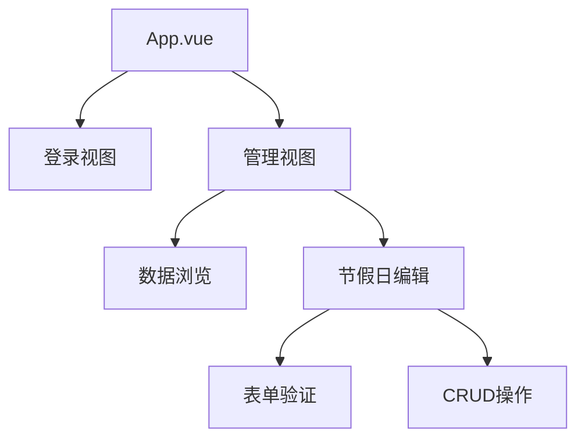

# 项目技术文档

## 1. 后端架构
### 技术栈
- Egg.js 框架
- MySQL 数据库

### 核心模块
#### 节假日服务 (app/service/holiday.js)
- 实现完整CRUD操作：
  ```javascript
  class HolidayService extends Service {
    async list() {}    // 分页查询
    async create() {}  // 创建记录
    async update() {}  // 更新记录
    async delete() {}  // 删除记录
  }
  ```
- 数据库表结构：`holidays_list`
  | 字段 | 类型 | 描述 |
  |------|------|------|
  | id | int | 主键 |
  | name | varchar | 节假日名称 |
  | day | int | 放假天数 |
  | img | varchar | 图片路径 |
  | date | date | 节假日日期 |
  | week | varchar | 星期 |

### API 接口规范
- 统一响应格式：
  ```json
  {
    "code": 200,
    "message": "操作描述",
    "data": {}
  }
  ```

## 2. 前端架构
### 技术栈
- Vue3 组合式API
- NaiveUI 组件库
- Vite 构建工具

### 组件结构


### 核心实现
- 状态管理：Pinia (stores目录)
- 请求封装：Axios (utils/request.ts)
- 组件通信：Props/Emits

## 3. 部署说明
- 后端：Node.js（20.19.3） 生产环境
- 前端：Vite 构建静态资源